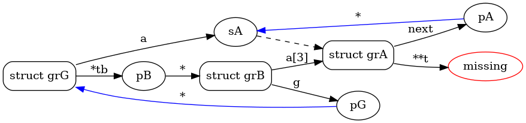

Usage
=====

We now provide a description of the ccrawl command-line tool which defines several sub-commands.
Of course, the ccrawl package can be used as well as a traditional package within Python scripts.

ccrawl's initial command consist in building a local database from C/C++ (header) files.
The libclang_ library is used to extract the following features::

 - definitions of macros (#define)
 - definitions of simple types (typedef)
 - definitions of structured types (struct, union, enum, class & template)
 - definitions of function types (prototypes)

Since files are only parsed and not compiled by libclang, the set of included files can be
imcomplete and syntax errors only lead to ignored definitions. Of course, many queries do
require ultimately that all subtypes of a structure have been collected but this is not enforced
by ccrawl at parsing time. ccrawl will also try to extract comments associated to these features
when possible.

The local database is a TinyDB JSON Storage file. For performance and scaling reasons, ccrawl
supports also the use of a remote MongoDB database allowing massive indexing of
the samples built locally.

Commands
--------

These global options which apply to all commands are::

    $ ccrawl [-v, --verbose]                display more infos
             [-q, --quiet]                  don't display anything
             [-c, --config <file>]          path to configuration file
             [-l, --local <file>]           path to local database file
             [-b, --db <url>]               url for the remote database
             [-g, --tag <name>]             filter queries with given tag
             [--help]                       show this message
             [<command> [options] [args]]

All default parameters are possibly overwritten by a configuration file (which defaults to
*$HOME/.ccrawlrc* unless provided with the -c option.) The format of the configuration file is
based on the traitlets_ python package.
Parameters allow to set the default python interpreter, the mandatory pathname of the
libclang_ library required by the libclang python wrapper, the default local database path
or remote database url.

Documents of the local database are stored with the following json format::

    {'cls': '<class>',
     'id' : '<identifier>',
     'src': '<path>',
     'tag': '<name>',
     'val': <object>}

For example, structure ``struct _mystruct`` in file *"samples/header.h"* is stored as::

     {'cls': 'cStruct',
        'id': 'struct _mystruct',
        'src': 'samples/header.h',
        'tag': '1654709776.1331487',
        'val': [['myinteger', 'I', None],
                ['int [12]', 'tab', None],
                ['unsigned char [16]', 'p', None],
                ['short *', 's', None],
                ['struct _mystruct *', 'next', None],
                ['foo', 'func', None],
                ['struct _bar [2]', 'bar', None]
               ]}

(Notice that if no ``--tag`` global option is provided, the default tag name is constructed from
the current collect time.)

Collect
+++++++

The ``collect`` command locally extracts definitions from the provided sources <src>::

    $ ccrawl [global options] collect [options] <src>

      options: [-a, --all]        by default, only header files with '*.h' extension are
                                  considered, this option forces extraction from all provided 
                                  files.
               [-t, --types]      extraction is limited to types (typedefs, struct, union, enum)
               [-f, --functions]  extraction is limited to function prototypes
               [-m, --macros]     extraction is limited to macros

               [-s, --strict]     collect in "strict" mode: in this mode, all errors reported by
                                  libclang are blocking. It is thus mandatory to provide the
                                  complete set of input files and precise clang options such that
                                  clang is able to compile successfully the provided <src> files.
               [--clang "<opts>"] pass <opts> string directly to clang as options

               <src> ...          directory name(s) or file name(s) of C source(s) from which
                                  selected definitions shall be extracted and collected in the
                                  local database.

For example:

.. code-block:: console

    $ cd tests/
    $ ccrawl -b None -l test.db collect samples/
    [  6%] samples/classes.hpp                                     [ 12]
    [ 12%] samples/00_empty.h                                      [  0]
    [ 18%] samples/simple.h                                        [  2]
    [ 25%] samples/header.h                                        [ 27]
    [ 31%] samples/bitfield.h                                      [  2]
    [ 37%] samples/inclusion_err.h                                 [  2]
    [ 43%] samples/auto.h                                          [  5]
    [ 56%] samples/wonza.hpp                                       [ 17]
    [ 62%] samples/stru.h                                          [  2]
    [ 68%] samples/derived.hpp                                     [  4]
    [ 75%] samples/cxxabi.h                                        [ 17]
    [ 81%] samples/xxx/yyy/somewhere.h                             [ 12]
    [ 87%] samples/templates.hpp                                   [414]
    [ 93%] samples/c_linkage.hpp                                   [  1]
    [100%] samples/fwd_decl.hpp                                    [  2]
    --------------------------------------------------------------------
    saving database...                                            [ 505]

Search
++++++

The ``search`` command performs a regular expression search within database 'id' and 'val' keys::

    $ ccrawl [global options] search <rex>

               <rex>              python (re) regular expression matched against local database
                                  documents keys 'id' and 'val'. Documents are filtered with
                                  'tag' as well if the --tag global options is used.

For example:

.. code-block:: console

    $ ccrawl -b None -l test.db search "_my"
    found cStruct identifer "struct _mystruct" with matching value
    found cTypedef identifer "mystruct" with matching value
    found cStruct identifer "struct ?_ba24571a" with matching value
    found cTypedef identifer "myunion" with matching value

Select
++++++

The ``select`` command performs advanced queries within the local database::

    $ ccrawl [global options] select [-a, --ands <str>]
                                     [-o, --ors  <str>]
                                     [<select_command> [options] [args]]

               [-a, --ands <str>] filters <str> of the form "key=value" added to current query
                                  with operator AND:
                                  Equivalent to "Q &= where(key).search(value)".
               [-o, --ors <str>]  same form, but added to current query with operator OR:
                                  Equivalent to "Q |= where(key).search(value)".

               <select_command>:

               prototype "<pos>:<type>" ...
                         Find prototypes (cls=cFunc) for which constraints of the form 
                         "<pos>:<type>" matches. Such constraint indicates that
                         argument located at <pos> index has C type <type>
                         (position index 0 designates the return value of the function).

               constant [-m, --mask] <value>
                         Find which macro definition or enum field name matches constant <value>.
                         Option --mask allows to look for the set of macros or enum symbols
                         that equals <value> when OR-ed.

               struct [-d, --def] [-p, --pointer {4 or 8}] "<offset>:<type>" ...
                         Find structures (cls=cStruct) satisfying constraints of the form:
                         "<offset>:<type>" where offset indicates a byte offset value (or '*')
                         and type is a C type name, symbol '?', '*' or a byte size value:
                         If <type> is "?", match any type at given offset,
                         If <type> is "*", match any pointer type at given offset,
                         If <type> is "+<val>", match if sizeof(type)==val at given offset.
                         If "*:+<val>", match struct only if sizeof(struct)==val.
                         Option --def outputs the definitions of found types rather than
                         their identifiers.

For example::

    $ ccrawl -b None -l test.db select constant -s "MY" 0x10
    MYCONST
    $ ccrawl -b None -l test.db select struct -p 8 "*:+104"
    [####################################]  100%
    struct _mystruct
    class X::D
    $ ccrawl -b None -l test.db select -a id="class X::D" struct -p 8 -d "*:+104"
    struct __layout$X::D {
     void *__vptr$C1;
     int c;
     void *__vptr$C2;
     int cc;
     int x;
     int ccc;
     int d;
     void *__vptr$V1;
     int a;
     void *__vptr$A2;
     int aa;
     int v;
     void *__vptr$V3;
     void *__vptr$V2;
     int b;
     int bb;
     int vv;
    };

Show
++++

The ``show`` command allows to recursively output a given identifier in various formats::

    $ ccrawl [global options] show [options] <identifier>

      options: [-r, --recursive]     recursively include all required definitions in the output
                                     such that type <identifier> is fully defined.
               [-f, --format <fmt>]  use output format <fmt>. Defaults to C, other formats are
                                     "ctypes", "amoco".

For example:

.. code-block:: console

    $ ccrawl -b None -l test.db show -r 'struct _mystruct'
    typedef unsigned char xxx;
    typedef xxx myinteger;
    struct _mystruct;
    typedef int (*foo)(int, char, unsigned int, void *);
    enum X {
      X_0 = 0,
      X_1 = 1,
      X_2 = 2,
      X_3 = 3
    };
    
    struct _bar {
      enum X x;
    };
    
    struct _mystruct {
      myinteger I;
      int tab[12];
      unsigned char p[16];
      short *s;
      struct _mystruct *next;
      foo func;
      struct _bar bar[2];
    };

Info
++++

The ``info`` command provides meta-data information about a given identifier. For structures
the offsets and sizes of every field is displayed if all subtypes are defined::

    $ ccrawl [global options] info [options] <identifier>

      options: [-p <size>]     size (4 or 8) of pointers used to compute fields' offsets for
                               info on structures

For example:

.. code-block:: console

    $ ccrawl -b None -l test.db info 'struct _mystruct'
    identifier: struct _mystruct
    class     : cStruct
    source    : samples/header.h
    tag       : xxx
    size      : 104
    offsets   : [(0, 1), (4, 48), (52, 16), (72, 8), (80, 8), (88, 8), (96, 2)]

Graph
+++++

The ``graph`` command outputs the dot-format dependency graph associated to a given type.
the graph nodes are the types names and edges show the dependency from one type to another,
ie essentially the structures' field (and pointer accessor) that binds those types::

    $ ccrawl [global options] graph [options] <identifier>

      options: [-o <file>]     output filename (defaults to stdout)

For example:

.. code-block:: console

    $ ccrawl -b None -l test.db graph 'struct grG'
    //graph is connected
    //graph has a strongly connected component of size 3
    //graph has a strongly connected component of size 4
    digraph {
      rankdir="LR"
      node [style="rounded"]
      v0 [label="struct grG"  shape="box"]
      v1 [label="sA" ]
      v2 [label="struct grA"  shape="box"]
      v3 [label="pA" ]
      v4 [label="missing"  color="red"]
      v5 [label="pB" ]
      v6 [label="struct grB"  shape="box"]
      v7 [label="pG" ]
      v0 -> v1 [label="a"]
      v1 -> v2 [style="dashed"]
      v2 -> v3 [label="next"]
      v3 -> v1 [label="*" color="blue"]
      v2 -> v4 [label="**t"]
      v0 -> v5 [label="*tb"]
      v5 -> v6 [label="*"]
      v6 -> v7 [label="g"]
      v7 -> v0 [label="*" color="blue"]
      v6 -> v2 [label="a[3]"]
    }

which results in:

.. _libclang: https://clang.llvm.org/doxygen/group__CINDEX.html
.. _traitlets: https://traitlets.readthedocs.io/en/stable/
